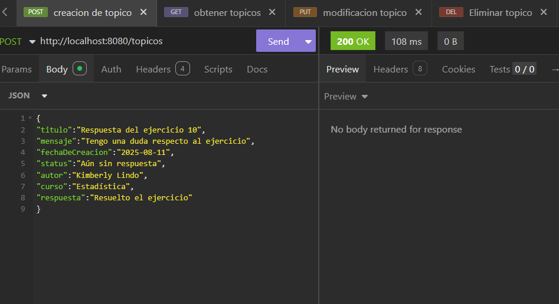
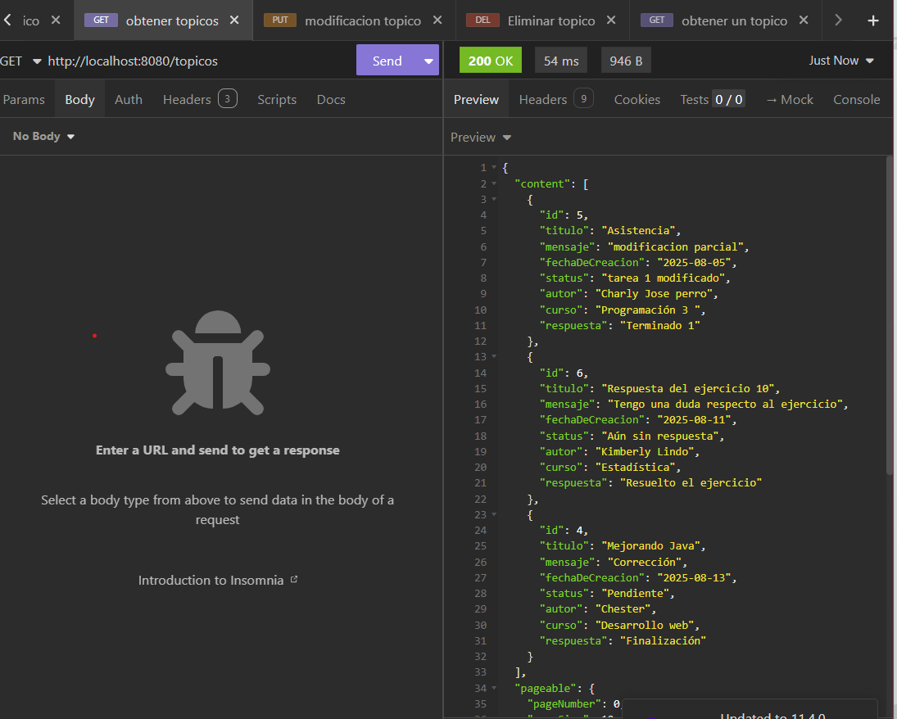
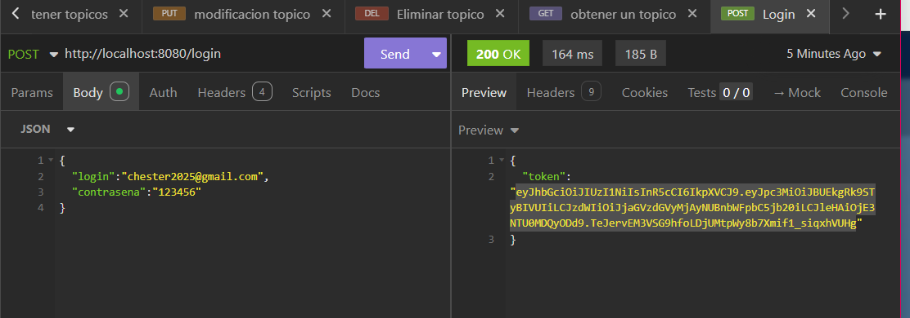
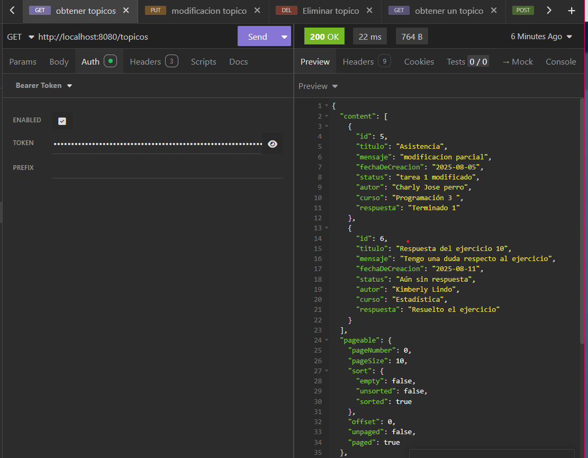

# Foro Hub Challenge - Backend

API REST desarrollada con **Spring Boot** que gestiona los tópicos de un foro.  
Permite crear, listar, consultar, actualizar y eliminar registros en la base de datos.

---

## 🚀 Tecnologías utilizadas
- **Java 17+**
- **Spring Boot 3**
- **Spring Web**
- **Spring Data JPA** (con Hibernate)
- **MySQL**
- **Flyway** (migraciones automáticas)
- **Lombok**
- **Jakarta Validation**

---

## 📂 Estructura del proyecto
````
Foro-hub-challenge/
├── src/
│ ├── main/
│ │ ├── java/
│ │ │ └── com/alura/Foro/Hub/challenge/
│ │ │ ├── controller/
│ │ │ │ └── TopicoController.java # Controlador REST
│ │ │ └── topico/
│ │ │ ├── DatosActualizarTopico.java # DTO para actualización
│ │ │ ├── DatosListaTopicos.java # DTO para respuestas
│ │ │ ├── DatosRegistroTopico.java # DTO para creación
│ │ │ ├── Topico.java # Entidad JPA
│ │ │ └── TopicoRepository.java # Repositorio JPA
│ │ └── resources/
│ │ └── db/migration/
│ │ └── V1__create-table-topicos.sql # Script Flyway para crear tabla

````

### Descripción de paquetes
- **controller/** → Contiene los controladores que exponen la API REST (`TopicoController`).
- **topico/** → Lógica principal:
    - **Entidad JPA** (`Topico`) que representa la tabla en la base de datos.
    - **DTOs** para recibir y enviar datos.
    - **Repositorio** (`TopicoRepository`) para interactuar con la base de datos.
- **resources/db/migration/** → Carpeta de migraciones de **Flyway** para inicializar la base de datos.

@Transactional asegura que las operaciones sobre la base de datos sean seguras: si algo falla en medio del proceso, los cambios se revierten.

El uso de DTOs permite separar la representación de datos que se envía/recibe por la API del modelo interno de la base de datos.

Flyway gestiona automáticamente las migraciones para mantener la estructura de la base de datos sincronizada con el código.

---

##  Endpoints principales
En el controlador `TopicoController` se encuentran los métodos para manejar las operaciones sobre los tópicos.  
Cada uno está mapeado con una anotación como `@GetMapping`, `@PostMapping`, `@PutMapping` o `@DeleteMapping`, que indican el tipo de operación HTTP que ejecuta.

### Crear un tópico (Post)
- **POST (/topicos)** 
Crea un nuevo tópico en la base de datos.  
Se utiliza `@PostMapping` para indicar que es una operación de creación y `@Transactional` para garantizar que si algo falla durante el guardado, la operación se revierta y no deje datos incompletos.

### Obtener tópicos (Get)
- **GET (/topicos)** 
Lista todos los tópicos con paginación.  
`@GetMapping` se usa para leer información sin modificar nada.

### Obtener un Tópico (Get con id)
- **GET (/topicos/{id})** 
Obtiene un tópico específico por su ID.  
Útil para consultar un único registro y devolverlo en un formato controlado mediante un DTO.
### Actualizar un Tópico (Put con id)
- **PUT (/topicos)** 
Actualiza un tópico existente.  
Se usa `@PutMapping` y `@Transactional`, ya que al modificar datos es importante que la operación sea atómica: o se actualiza completamente o no se hace nada.
### Eliminar un Tópico (Delete con id)
- **DELETE (/topicos/{id})** 
Elimina un tópico por su ID.  
Con `@DeleteMapping` y `@Transactional` se asegura que la eliminación sea definitiva y consistente.

## Imagenes de los endpoints

### Creación de tópico- Post


### Obtener tópicos - Get


### Obtener un tópico - Get{id}


### Actualizar un tópico - Put{id}


### Eliminar un tópico - Delete{id}


### Iniciar sesión(Login) -Post/login


### Ejemplo mostrar un tópico con Token JWT


## Creación de base de datos en Mysql
Se creó una base de datos llamada foro y una tabla llamada topicos

```
create table topicos(
    id bigint not null auto_increment,
    titulo VARCHAR(100) not null UNIQUE,
    mensaje VARCHAR(100) not null UNIQUE,
    fechaDeCreacion DATE not null,
    status VARCHAR(100) not null,
    autor VARCHAR(50) not null,
    curso VARCHAR(100) not null,
    respuesta VARCHAR(100) not null,

    primary key(id)
````

## Autenticación y Seguridad con JWT

El proyecto implementa un sistema de autenticación basado en JSON Web Tokens (JWT) para garantizar la seguridad de los endpoints y restringir el acceso a usuarios autenticados.
 
## Características principales

Generación de Token JWT:
Al iniciar sesión con credenciales válidas, el sistema genera un token JWT que incluye información del usuario y una fecha de expiración.

Validación de Token en cada petición:
Los endpoints protegidos requieren el envío del token en el header de autorización con el formato:

Authorization: Bearer <token>

## Implementación de filtros personalizados:
Se desarrollaron filtros de seguridad que interceptan las peticiones HTTP, validan la firma del token y autentican al usuario antes de permitir el acceso a los recursos.

Roles y permisos:
La aplicación puede configurarse para que ciertos endpoints estén disponibles solo para usuarios con un rol específico (ejemplo: administrador, moderador, usuario estándar). En este caso, solo tiene un solo ROLE_USER.

## Flujo de autenticación

El usuario envía sus credenciales (usuario/contraseña) al endpoint /login.

Si las credenciales son válidas, el sistema responde con un JWT.

El cliente utiliza el JWT en el encabezado de autorización para acceder a los endpoints protegidos.

El filtro de validación JWT verifica el token en cada petición.

Si el token es válido y no ha expirado, se permite el acceso al recurso solicitado.


Desarrollado por: Yamileth Caldera